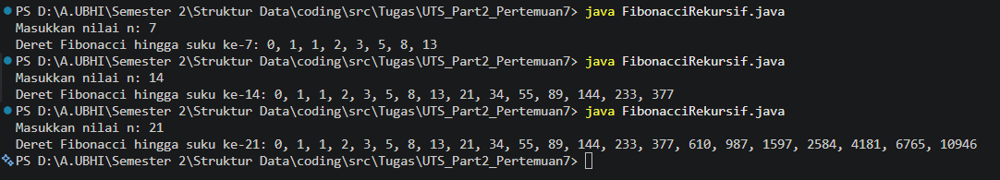

---

# Tugas UTS Part 2 - Struktur Data (Fibonacci Rekursif)

## 👤 Identitas
- **Nama:** Alvin Widiantara
- **NIM:** 25161562037
- **Kelas:** INF2A


---

Repository ini berisi codingan Java untuk mengimplementasikan **fungsi rekursif** dalam menghitung deret Fibonacci berdasarkan suku ke-n yang dimasukkan pengguna.

## Deskripsi Codingan
Program ini menggunakan algoritma rekursif dengan ketentuan:
1. **Base Case**: 
   - `fibonacci(0)` mengembalikan nilai 0
   - `fibonacci(1)` mengembalikan nilai 1
2. **Rekursif Case**: `fibonacci(n) = fibonacci(n-1) + fibonacci(n-2)` untuk n > 1

Program ini akan meminta input dari pengguna berupa nilai **n**, lalu menampilkan deret Fibonacci dari suku ke-0 hingga suku ke-n secara berurutan dalam satu baris.

## Struktur Program
Kode ini disusun secara modular agar mudah dipahami:
1. **Fungsi `fibonacci(int n)`**: Fungsi rekursif utama yang menghitung nilai Fibonacci ke-n dengan memanggil dirinya sendiri.
2. **Method `main`**: 
   - Membuat objek `Scanner` untuk menerima input dari pengguna.
   - Meminta pengguna memasukkan nilai n.
   - Melakukan perulangan `for` dari i = 0 sampai n untuk mencetak setiap suku Fibonacci.
   - Memanggil fungsi `fibonacci(i)` di setiap iterasi.
   - Menampilkan output dengan pemisah koma (`, `) antar suku.
   - Menutup objek `Scanner` untuk mencegah kebocoran resource.

## Contoh Output
```
Masukkan nilai n: 7
Deret Fibonacci hingga suku ke-7: 0, 1, 1, 2, 3, 5, 8, 13
```

## Hasil Output Terminal



## Kompleksitas Waktu
- **Time Complexity:** O(2ⁿ) karena setiap panggilan rekursif bercabang menjadi dua panggilan baru.
- **Space Complexity:** O(n) karena kedalaman stack rekursif maksimal mencapai n.

---
*Dibuat untuk memenuhi tugas mata kuliah Struktur Data Semester 2.*